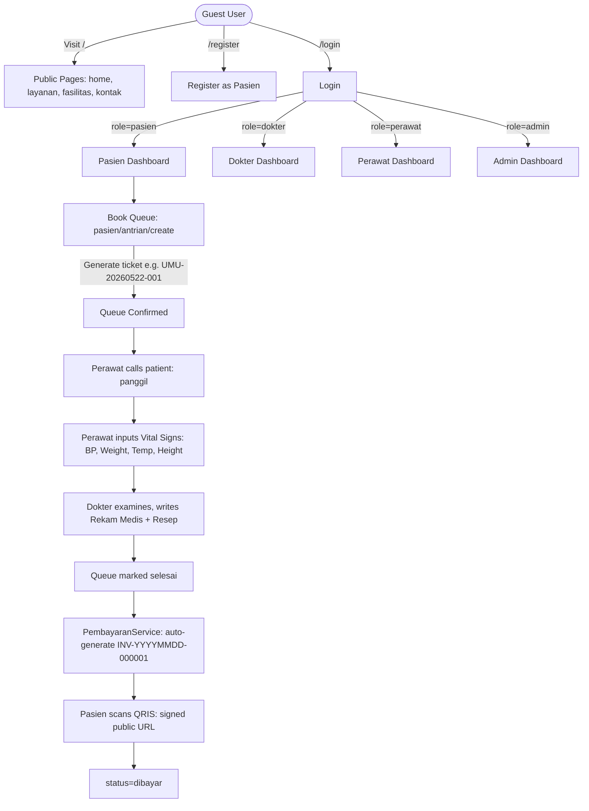

# HealthDigital — Complete Project Blueprint & Context

> This file is the single authoritative reference for the **HealthDigital** project.
> Read this before writing any code in a new session.

---

## 1. Project Overview & Tech Stack

| Attribute | Detail |
| :--- | :--- |
| **Name** | HealthDigital — Platform Layanan Kesehatan Berbasis Web |
| **Framework** | Laravel 12 |
| **Frontend** | Tailwind CSS v4 + Alpine.js + Vite |
| **Database** | MySQL 8.0.30 |
| **PHP** | 8.3+ |
| **UX Philosophy** | Jakob Nielsen's 10 Usability Heuristics |
| **Theme** | White & Blue — clean, minimalist, medical |
| **PDF Export** | Barryvdh DomPDF (installed, used for Laporan & Rekam Medis) |

**Description**: A digital healthcare ecosystem connecting Patients, Doctors, Nurses, and Administrators. Core features include online queue registration, nurse pre-exam triage (vital signs), digital medical records, asynchronous doctor-patient consultation threads, invoice generation with **QRIS-only payment simulation** (signed URL-based scan), and public service catalogs.

---

## 2. Directory Structure (Actual Files on Disk)

```
healthdigital/
├── app/
│   ├── Http/
│   │   ├── Controllers/
│   │   │   ├── Auth/AuthController.php          # Login, Register, ForgotPassword, Logout
│   │   │   ├── Pasien/
│   │   │   │   ├── AntrianController.php         # index, create, store, show, update
│   │   │   │   ├── DashboardController.php       # index, bantuan
│   │   │   │   ├── KonsultasiController.php      # index, create, store, show, update, cekDuplikat
│   │   │   │   ├── PembayaranController.php      # index, show, bayar, qrisScan
│   │   │   │   └── RekamMedisController.php      # index, show
│   │   │   ├── Dokter/
│   │   │   │   ├── AntrianController.php         # index, updateStatus
│   │   │   │   ├── DashboardController.php
│   │   │   │   ├── KonsultasiController.php      # index, show, update (jawab/tutup)
│   │   │   │   └── RekamMedisController.php      # index, create, store, show, edit, update
│   │   │   ├── Perawat/
│   │   │   │   ├── AntrianController.php         # index, show, create, store, panggil, simpanVitalSigns
│   │   │   │   ├── DashboardController.php
│   │   │   │   └── RekamMedisController.php      # index, show, tambahCatatan
│   │   │   ├── Admin/
│   │   │   │   ├── DashboardController.php
│   │   │   │   ├── FasilitasController.php       # resource (index, create, store, edit, update, destroy)
│   │   │   │   ├── LaporanController.php         # index, export (PDF via DomPDF)
│   │   │   │   ├── LayananController.php         # resource (index, create, store, edit, update, destroy)
│   │   │   │   ├── PembayaranController.php      # index only (no verifikasi route)
│   │   │   │   └── UserController.php            # resource + toggleAktif
│   │   │   ├── ProfileController.php             # index (GET /profil), update (PUT /profil)
│   │   │   └── PublicController.php              # home, layanan, fasilitas, kontak
│   │   └── Middleware/
│   │       └── RoleMiddleware.php                # Guards pages by role + checks is_active
│   ├── Models/
│   │   ├── User.php          # role ENUM, avatar, getAvatarUrlAttribute(), is_active
│   │   ├── Pasien.php        # nik, no_bpjs, tanggal_lahir, jenis_kelamin, golongan_darah, alamat, kota, pekerjaan
│   │   ├── Dokter.php        # no_str, spesialisasi, jadwal (JSON→array), tarif_konsultasi, bio
│   │   ├── Perawat.php       # no_str, bagian
│   │   ├── Antrian.php       # status ENUM, vital_signs fields, catatan_perawat
│   │   ├── RekamMedis.php    # diagnosa, resep (JSON→array), vital signs (copied from antrian at exam time)
│   │   ├── Konsultasi.php    # judul, pesan, balasan (legacy), status, dibaca_dokter, dibaca_pasien
│   │   ├── PesanKonsultasi.php  # Thread messages: konsultasi_id, pengirim ENUM, pesan
│   │   ├── Pembayaran.php    # antrian_id (nullable), konsultasi_id (nullable), reference (UUID), alasan_tolak
│   │   ├── Layanan.php       # nama, deskripsi, ikon, gambar (nullable), is_active, urutan; scopeAktif()
│   │   └── Fasilitas.php     # nama, deskripsi, foto, is_active; scopeAktif()
│   └── Services/
│       ├── AntrianService.php      # generateNomor(), batalkan(), panggil(), selesaikan()
│       └── PembayaranService.php   # generateInvoice(), buatTagihan()
├── database/
│   ├── migrations/            # 19 total (see Section 5)
│   └── seeders/
│       ├── DatabaseSeeder.php       # Calls: LayananSeeder, FasilitasSeeder, UserSeeder
│       ├── LayananSeeder.php
│       ├── FasilitasSeeder.php
│       └── UserSeeder.php
├── resources/
│   ├── css/app.css            # Tailwind v4 @import, @theme tokens, base component classes
│   ├── js/app.js              # Alpine.js import
│   └── views/
│       ├── layouts/
│       │   ├── public.blade.php     # Guest sticky navbar + footer
│       │   ├── auth.blade.php       # Centered card wrapper (login/register/forgot)
│       │   └── app.blade.php        # Dashboard: topnav + sidebar slot + flash messages + modals
│       ├── auth/              # login.blade.php, register.blade.php, forgot-password.blade.php
│       ├── profile/           # index.blade.php (edit email, phone, password)
│       ├── public/            # home, layanan, fasilitas, kontak
│       ├── pasien/            # dashboard, bantuan, antrian/, konsultasi/, pembayaran/, rekam-medis/
│       ├── dokter/            # dashboard, antrian/, konsultasi/, rekam-medis/
│       ├── perawat/           # dashboard, antrian/, rekam-medis/
│       ├── admin/             # dashboard, users/, layanan/, fasilitas/, pembayaran/, laporan/
│       ├── qris/              # success.blade.php, expired.blade.php (QRIS scan result pages)
│       └── errors/            # 403.blade.php
└── routes/
    ├── web.php                # All application routes
    └── console.php            # Artisan schedule (empty)
```

> **Note**: `welcome.blade.php` was the default Laravel starter page — it was **deleted** as it is never served by any route in this project.

---

## 3. Architecture Flow



---

## 4. Active Routes (routes/web.php — exact)

### Public Routes
```
GET  /                              → PublicController@home          [name: home]
GET  /layanan                       → PublicController@layanan        [name: layanan]
GET  /fasilitas                     → PublicController@fasilitas      [name: fasilitas]
GET  /kontak                        → PublicController@kontak         [name: kontak]
GET  /qris/scan/{reference}         → Pasien\PembayaranController@qrisScan [name: qris.scan] (signed URL, public)
```

### Auth Routes (guest middleware)
```
GET   /login                        → AuthController@showLogin        [name: login]
POST  /login                        → AuthController@login
GET   /register                     → AuthController@showRegister     [name: register]
POST  /register                     → AuthController@register
GET   /forgot-password              → AuthController@showForgot       [name: password.request]
POST  /forgot-password              → AuthController@sendReset        [name: password.email]
```

### Auth Routes (auth middleware)
```
POST  /logout                       → AuthController@logout           [name: logout]
GET   /profil                       → ProfileController@index         [name: profile.index]
PUT   /profil                       → ProfileController@update        [name: profile.update]
```

### Pasien Portal (auth + role:pasien, prefix: /pasien)
```
GET     /pasien/dashboard           → [name: pasien.dashboard]
GET     /pasien/bantuan             → [name: pasien.bantuan]
GET     /pasien/antrian             → index  [name: pasien.antrian.index]
GET     /pasien/antrian/create      → create [name: pasien.antrian.create]
POST    /pasien/antrian             → store  [name: pasien.antrian.store]
GET     /pasien/antrian/{id}        → show   [name: pasien.antrian.show]
PATCH   /pasien/antrian/{id}        → update [name: pasien.antrian.update]  (batalkan)
GET     /pasien/konsultasi          → index  [name: pasien.konsultasi.index]
GET     /pasien/konsultasi/create   → create [name: pasien.konsultasi.create]
POST    /pasien/konsultasi          → store  [name: pasien.konsultasi.store]
GET     /pasien/konsultasi/{id}     → show   [name: pasien.konsultasi.show]
PUT     /pasien/konsultasi/{id}     → update [name: pasien.konsultasi.update] (add message)
GET     /pasien/konsultasi/cek-duplikat → cekDuplikat [name: pasien.konsultasi.cek-duplikat] (AJAX)
GET     /pasien/pembayaran          → index  [name: pasien.pembayaran.index]
GET     /pasien/pembayaran/{id}     → show   [name: pasien.pembayaran.show]
PUT     /pasien/pembayaran/{id}     → update [name: pasien.pembayaran.update]
POST    /pasien/pembayaran/{id}/bayar → bayar [name: pasien.pembayaran.bayar]
```

> **Note**: There is NO `pasien.rekam-medis` resource route in `routes/web.php`. The Pasien can view their own rekam medis via the Pasien RekamMedisController accessed internally.

### Dokter Portal (auth + role:dokter, prefix: /dokter)
```
GET     /dokter/dashboard           → [name: dokter.dashboard]
GET     /dokter/antrian             → index  [name: dokter.antrian.index]
PATCH   /dokter/antrian/{id}/status → updateStatus [name: dokter.antrian.status]
GET/POST/PUT /dokter/rekam-medis    → resource (index, create, store, show, edit, update)
GET/PUT /dokter/konsultasi          → resource (index, show, update)
```

### Perawat Portal (auth + role:perawat, prefix: /perawat)
```
GET     /perawat/dashboard          → [name: perawat.dashboard]
GET/POST/GET /perawat/antrian       → resource (index, show, create, store)
PATCH   /perawat/antrian/{id}/panggil        → panggil [name: perawat.antrian.panggil]
PATCH   /perawat/antrian/{id}/vital-signs    → simpanVitalSigns [name: perawat.antrian.vital-signs]
GET     /perawat/rekam-medis        → index [name: perawat.rekam-medis.index]
GET     /perawat/rekam-medis/{id}   → show  [name: perawat.rekam-medis.show]
PATCH   /perawat/rekam-medis/{id}/catatan → tambahCatatan [name: perawat.rekam-medis.catatan]
```

### Admin Portal (auth + role:admin, prefix: /admin)
```
GET     /admin/dashboard            → [name: admin.dashboard]
GET/POST/PUT/DELETE /admin/users    → resource + toggleAktif [name: admin.users.toggle]
GET/POST/PUT/DELETE /admin/layanan  → resource
GET/POST/PUT/DELETE /admin/fasilitas → resource
GET     /admin/pembayaran           → index [name: admin.pembayaran.index]
GET     /admin/laporan              → index [name: admin.laporan.index]
GET     /admin/laporan/export       → export PDF [name: admin.laporan.export]
```

> **Important**: There is **NO** `admin.pembayaran.verifikasi` route. Payment verification is handled directly via the Pasien's `bayar` action and the QRIS signed URL scan endpoint.

---

## 5. Database Schema (Verified against actual migrations)

### `users`
| Column | Type | Notes |
| :--- | :--- | :--- |
| id | BIGINT PK | |
| name | VARCHAR(255) | |
| email | VARCHAR(255) UNIQUE | |
| password | VARCHAR(255) | bcrypt hashed |
| role | ENUM | `pasien`, `dokter`, `perawat`, `admin` |
| phone | VARCHAR(20) nullable | |
| avatar | VARCHAR(255) nullable | path relative to `storage/` |
| is_active | BOOLEAN | default true |
| email_verified_at | TIMESTAMP nullable | |
| remember_token | VARCHAR(100) | |

### `pasiens`
| Column | Type | Notes |
| :--- | :--- | :--- |
| id | BIGINT PK | |
| user_id | FK → users | cascade delete |
| nik | VARCHAR(16) UNIQUE | |
| no_bpjs | VARCHAR(20) UNIQUE nullable | |
| tanggal_lahir | DATE | |
| jenis_kelamin | ENUM | `L`, `P` |
| golongan_darah | ENUM nullable | `A`, `B`, `AB`, `O` |
| alamat | TEXT nullable | |
| kota | VARCHAR(100) nullable | |
| pekerjaan | VARCHAR(100) nullable | |

### `dokters`
| Column | Type | Notes |
| :--- | :--- | :--- |
| id | BIGINT PK | |
| user_id | FK → users | |
| no_str | VARCHAR(50) UNIQUE | |
| spesialisasi | VARCHAR(100) | |
| jadwal | JSON | `{"senin":["08:00","12:00"],...}` |
| tarif_konsultasi | DECIMAL(10,2) | default 0 |
| bio | TEXT nullable | |

### `perawats`
| Column | Type | Notes |
| :--- | :--- | :--- |
| id | BIGINT PK | |
| user_id | FK → users | |
| no_str | VARCHAR(50) UNIQUE | |
| bagian | VARCHAR(100) nullable | |

### `layanans`
| Column | Type | Notes |
| :--- | :--- | :--- |
| id | BIGINT PK | |
| nama | VARCHAR(255) | |
| deskripsi | TEXT nullable | |
| ikon | VARCHAR(100) nullable | |
| gambar | VARCHAR(255) nullable | **Added**: stores uploaded image path |
| is_active | BOOLEAN | default true |
| urutan | INT | default 0 |

### `fasilitas`
| Column | Type | Notes |
| :--- | :--- | :--- |
| id, nama, deskripsi, foto, is_active | — | |

### `antrians`
| Column | Type | Notes |
| :--- | :--- | :--- |
| id | BIGINT PK | |
| pasien_id | FK → pasiens | |
| dokter_id | FK → dokters | |
| layanan_id | FK → layanans | |
| tanggal | DATE | |
| no_antrian | VARCHAR(10) | e.g. `UMU-20260522-001` |
| keluhan | TEXT | |
| status | ENUM | `menunggu`, `dipanggil`, `selesai`, `batal` |
| catatan_perawat | TEXT nullable | |
| tekanan_darah | VARCHAR(20) nullable | **Added** by perawat at triage |
| berat_badan | DECIMAL(5,2) nullable | **Added** |
| tinggi_badan | DECIMAL(5,2) nullable | **Added** |
| suhu_tubuh | DECIMAL(4,1) nullable | **Added** |

### `rekam_medis`
| Column | Type | Notes |
| :--- | :--- | :--- |
| id | BIGINT PK | |
| antrian_id | FK → antrians | |
| pasien_id | FK → pasiens | |
| dokter_id | FK → dokters | |
| tanggal_periksa | DATE | |
| anamnesis | TEXT nullable | |
| diagnosa | TEXT | |
| tindakan | TEXT nullable | |
| resep | JSON | `[{"obat":"...","dosis":"...","aturan":"..."}]` |
| tekanan_darah | VARCHAR(20) nullable | copied from antrian |
| berat_badan | DECIMAL(5,2) nullable | |
| tinggi_badan | DECIMAL(5,2) nullable | |
| suhu_tubuh | DECIMAL(4,1) nullable | |
| catatan | TEXT nullable | |

### `konsultasis`
| Column | Type | Notes |
| :--- | :--- | :--- |
| id | BIGINT PK | |
| pasien_id | FK → pasiens | |
| dokter_id | FK → dokters | |
| judul | VARCHAR(255) | |
| pesan | TEXT | First message (legacy field, also stored in pesan_konsultasis) |
| balasan | TEXT nullable | Last reply (legacy field, also stored in pesan_konsultasis) |
| status | ENUM | `menunggu`, `dijawab`, `ditutup` |
| dibaca_dokter | BOOLEAN | default false |
| dibaca_pasien | BOOLEAN | default false |

### `pesan_konsultasis` (Chat Thread)
| Column | Type | Notes |
| :--- | :--- | :--- |
| id | BIGINT PK | |
| konsultasi_id | FK → konsultasis | cascade delete |
| pengirim | ENUM | `pasien`, `dokter` |
| pesan | TEXT | |

### `pembayarans`
| Column | Type | Notes |
| :--- | :--- | :--- |
| id | BIGINT PK | |
| antrian_id | FK → antrians nullable | null for consultation-only payments |
| konsultasi_id | FK → konsultasis nullable | **Added**: for direct consultation billing |
| pasien_id | FK → pasiens | |
| kode_invoice | VARCHAR(50) UNIQUE | `INV-YYYYMMDD-000001` or `KONSUL-YYYYMMDD-000001` |
| reference | UUID | **Added**: auto-generated, used for QRIS scan signed URL |
| jumlah | DECIMAL(12,2) | |
| metode | ENUM | `bpjs`, `transfer`, `tunai`, `qris` — **only `qris` is used in practice** |
| status | ENUM | `menunggu`, `dibayar`, `gagal`, `dikembalikan` |
| bukti_bayar | VARCHAR(255) nullable | receipt upload path |
| catatan | TEXT nullable | |
| alasan_tolak | TEXT nullable | **Added**: admin rejection reason |
| dibayar_pada | TIMESTAMP nullable | |
| verified_by | FK → users nullable | |

---

## 6. Business Logic

### 6.1 Queue Ticket Number — `AntrianService::generateNomor()`
```
Format: {LayananPrefix}-{YYYYMMDD}-{Sequence 3-digit}
Example: Poli Umum, 22 May 2026, first patient → UMU-20260522-001
Logic: Take first 3 alpha chars of layanan.nama, count existing antrians for same layanan+date
```

### 6.2 Queue State Machine — `AntrianService`
```
menunggu → dipanggil  (Perawat: panggil)
dipanggil → selesai   (Dokter: selesaikan)
menunggu | dipanggil → batal (Perawat/Admin: batalkan)
```

### 6.3 Invoice Generation — `PembayaranService::generateInvoice()`
```
Format: INV-{YYYYMMDD}-{DailyCount 6-digit}
Example: INV-20260522-000042
All payments use QRIS. Consultation payments are generated in KonsultasiController::store(),
format KONSUL-{YYYYMMDD}-{id padded 6 digits}.
```

### 6.4 QRIS Payment Flow (Only Payment Method)
```
1. PembayaranController::show() renders QRIS with a signed URL: route('qris.scan', ['reference'=>$p->reference])
2. Patient scans QR code → hits GET /qris/scan/{reference} (public, requires valid signed URL)
3. Controller verifies Laravel URL signature → sets status=dibayar, dibayar_pada=now()
4. Shows qris/success.blade.php
5. If URL is expired or tampered (signature invalid) → shows qris/expired.blade.php (403)

Note: The metode column still has BPJS/transfer/tunai ENUM values in the DB schema
but they are not exposed in any active UI. getMetodeLabelAttribute() always returns 'QRIS'.
```

### 6.5 Consultation Threading
```
- Konsultasi is a "session" between one Pasien and one Dokter.
- Messages are stored in pesan_konsultasis (konsultasi_id, pengirim, pesan).
- Pasien creates: initial pesan also saved as first PesanKonsultasi.
- Dokter replies: saves PesanKonsultasi with pengirim='dokter', sets status=dijawab.
- Dokter can close: sets status=ditutup (with optional message).
- Pasien can add follow-up messages: updates status back to 'menunggu'.
- Duplicate guard: Pasien cannot start new konsultasi to same Dokter if one is 'menunggu'.
- Payment gate: Creating a konsultasi auto-generates a QRIS Pembayaran.
```

---

## 7. Models & Relationships

```
User (1) ──────── (1) Pasien ─┬─ (many) Antrian ─ (1) RekamMedis
                               ├─ (many) Konsultasi
                               └─ (many) Pembayaran

User (1) ──────── (1) Dokter ─┬─ (many) Antrian
                               ├─ (many) RekamMedis
                               └─ (many) Konsultasi ─ (many) PesanKonsultasi

User (1) ──────── (1) Perawat

Antrian ─── (1) RekamMedis
Antrian ─── (1) Pembayaran [antrian_id nullable for consultation payments]

Konsultasi ─── (many) PesanKonsultasi
Konsultasi ─── (1) Pembayaran [konsultasi_id]
```

### Key Model Accessors
| Model | Accessor | Returns |
| :--- | :--- | :--- |
| `User` | `avatar_url` | `storage/{avatar}` or `asset('images/image.png')` |
| `Antrian` | `status_badge_color` | `warning`/`info`/`success`/`danger` |
| `Antrian` | `status_label` | Human-readable Indonesian status |
| `Pembayaran` | `status_label` | Menunggu Pembayaran / Lunas / Gagal / Dikembalikan |
| `Pembayaran` | `metode_label` | Always `'QRIS'` (only active payment method) |
| `Pembayaran` | `jenis` | `konsultasi` or `antrian` |
| `Pembayaran` | `jumlah_format` | `Rp 150.000` |
| `Layanan` | `gambar_url` | `Storage::url(gambar)` or `null` |
| `Pasien` | `umur` | Age calculated from tanggal_lahir |

---

## 8. Middleware

Only **one custom middleware** exists:

### `RoleMiddleware` — aliased as `role`
Registered in `bootstrap/app.php`:
```php
$middleware->alias(['role' => \App\Http\Middleware\RoleMiddleware::class]);
```
Logic:
1. If not authenticated → redirect to `login`
2. If authenticated but `is_active = false` → logout + redirect to `login` with error
3. If role not in allowed list → `abort(403)`

> **Note**: `CheckProfileComplete` middleware mentioned in older docs **does not exist** in this codebase.

---

## 9. Login Redirect by Role
```php
// AuthController::login()
$redirectMap = [
    'pasien'  => route('pasien.dashboard'),
    'dokter'  => route('dokter.dashboard'),
    'perawat' => route('perawat.dashboard'),
    'admin'   => route('admin.dashboard'),
];
```

---

## 10. Default Seeded Accounts (UserSeeder.php — verified)

**Seeder order** (`DatabaseSeeder.php`): `LayananSeeder → FasilitasSeeder → UserSeeder`

### Admin
| Email | Password |
| :--- | :--- |
| `admin@healthdigital.id` | `admin123` |

### Perawat
| Email | Password | Bagian |
| :--- | :--- | :--- |
| `perawat@healthdigital.id` | `password` | Rawat Jalan |

### Pasien
| Email | Password | NIK |
| :--- | :--- | :--- |
| `pasien@gmail.com` | `password` | 3201234567890001 |

### Dokter (all password: `password`)
| Name | Email | Specialization | STR |
| :--- | :--- | :--- | :--- |
| Dr. Andi | `andi@healthdigital.id` | Dokter Umum | STR-DKT-001 |
| Dr. Budi | `budi@healthdigital.id` | Dokter Umum | STR-DKT-002 |
| Drg. Citra | `citra@healthdigital.id` | Spesialis Gigi | STR-GIG-001 |
| Drg. Diana | `diana@healthdigital.id` | Spesialis Gigi | STR-GIG-002 |
| Dr. Eka | `eka@healthdigital.id` | Spesialis Anak | STR-ANK-001 |
| Dr. Fajar | `fajar@healthdigital.id` | Spesialis Anak | STR-ANK-002 |
| Dr. Gita | `gita@healthdigital.id` | Spesialis Kandungan | STR-KND-001 |
| Dr. Hari | `hari@healthdigital.id` | Spesialis Kandungan | STR-KND-002 |

---

## 11. Branding Refactoring (Recent — Verified)

All three layout files now use `images/image.png` as the project logo:

| Layout | Usage | Container |
| :--- | :--- | :--- |
| `layouts/public.blade.php` | Navbar header + footer | `2.25rem` gradient div (blue→cyan) |
| `layouts/auth.blade.php` | Centered card header above form | `3rem` gradient div, `1.75rem` img |
| `layouts/app.blade.php` | Dashboard topnav | `2rem` gradient div, `1.25rem` img |

**Default Avatar Fallback** — `app/Models/User.php`:
```php
public function getAvatarUrlAttribute(): string
{
    if ($this->avatar) {
        return asset('storage/' . $this->avatar);
    }
    return asset('images/image.png'); // Unified brand logo as default avatar
}
```
This affects sidebars, nav dropdowns, admin user tables, and doctor cards on the public homepage.

---

## 12. Known Quirks & Gotchas

1. **`konsultasis` table has legacy fields**: `pesan` and `balasan` columns still exist in the DB and model `$fillable`. In practice the real messages are in `pesan_konsultasis`. The `KonsultasiController` (Dokter) still writes `$request->balasan` to the thread but does not update the `balasan` column.

2. **Vital signs are duplicated**: They exist on `antrians` (input by Perawat) and copied to `rekam_medis` (filled by Dokter at examination time). This is by design.

3. **`Pembayaran::verified_by`**: The column exists in the DB and `$fillable` but no UI or controller currently writes to it.

4. **`Pembayaran::bukti_bayar`**: Column exists but the upload UI for patients was simplified — currently only QRIS auto-confirm and `bayar` (direct confirm) are the active flows.

5. **`ProfileController::update()`**: Does NOT handle avatar uploads — it only updates `email`, `phone`, and `password`. Avatar upload UI if present is decorative/incomplete.

---

## 13. Development Quickstart

```powershell
# Run local server
php artisan serve

# Watch and compile assets
npm run dev

# Fresh reseed
php artisan migrate:fresh --seed

# Clear all caches
php artisan config:clear && php artisan route:clear && php artisan view:clear
```
